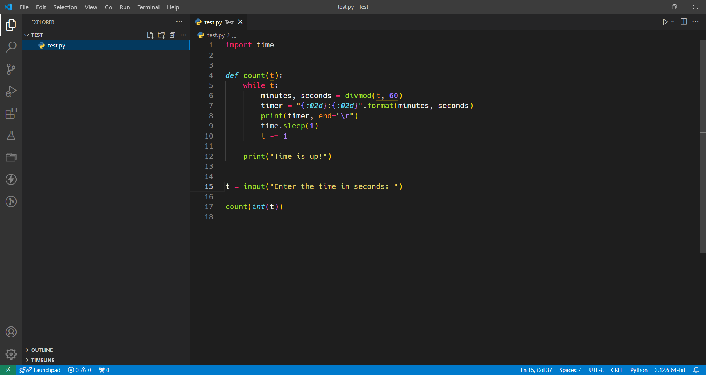
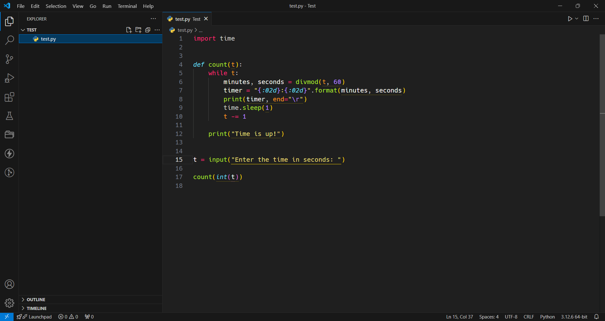

# Monokai DarkPlus for VsCode

A combination of the famous Monokai theme with the default VsCode Dark+ theme.

Simple theme, using Dark+ (default VSCode theme) for the window theme and Monokai for the editor theme.

Check the same theme but for [Azure Data Studio](https://github.com/filipeyay/monokai-darkplus-azure).

## Based on

- The original Monokai Theme
- The original VsCode Theme
