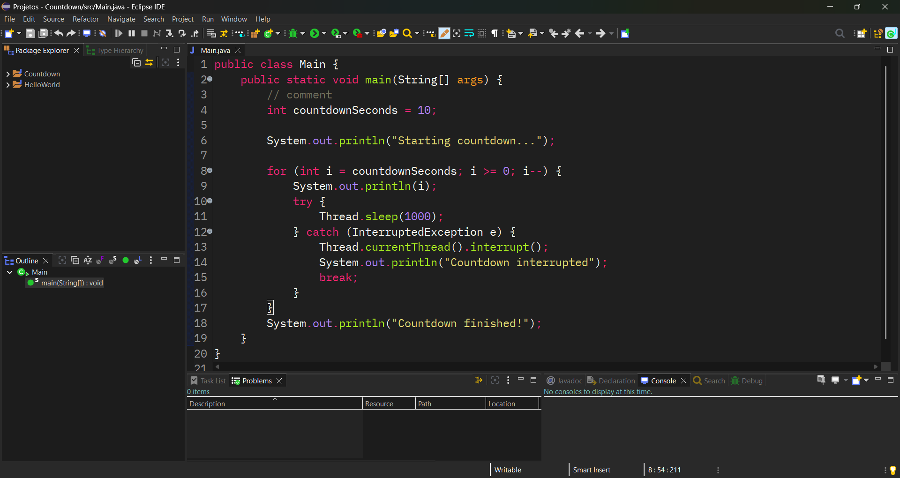
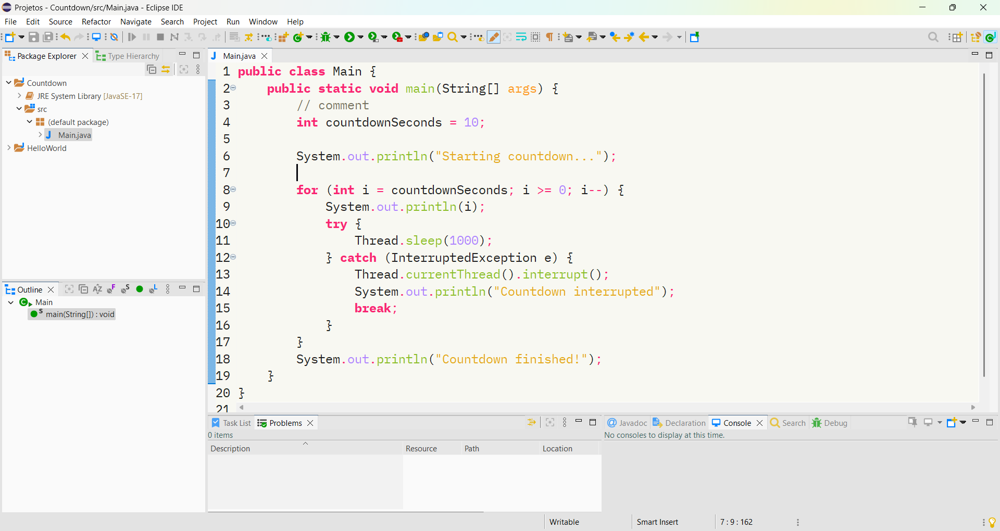

# Monokai DarkPlus for Eclipse IDE

For easy install use the [DevStyle](https://marketplace.eclipse.org/content/darkest-dark-theme-devstyle) extension.

## Showcase

Made with [JetBrains](../JetBrains/README.md) Monokai DarkPlus theme as base.
