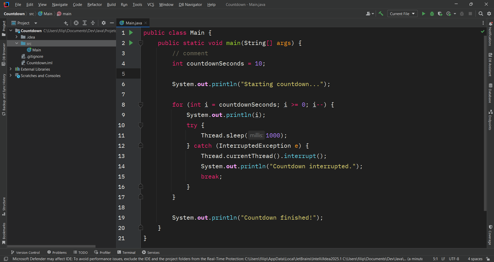

# JetBrains IntelliJ Monokai DarkPlus Color Scheme

## How to install

Since this is just a editor theme you just need to download the **Monokai_DarkPlus.icls** or **Monokai_DarkPlus_Darcula.icls** file on this directory.

Then go to:
`Setting > Apparence & Behavior > Apparence.`

On the `Editor color scheme:` click on the gear icon on the right and then click on `Import Scheme` and next click on `Intellij IDEA color scheme (.icls) or (.jar)`.
Finally select theme theme file on your computer.

## Showcase

## Extra

This theme goes great with other two extensions (used on image above):

- [Classic UI](https://plugins.jetbrains.com/plugin/24468-classic-ui)

- [VSCode Theme](https://plugins.jetbrains.com/plugin/19177-vscode-theme)

## Based on

- [Monokai Color Scheme by JetBrains](https://plugins.jetbrains.com/plugin/19029-monokai-color-scheme)
- [VSCode Theme by Dinesh](https://github.com/dinbtechit/vscode-theme)
